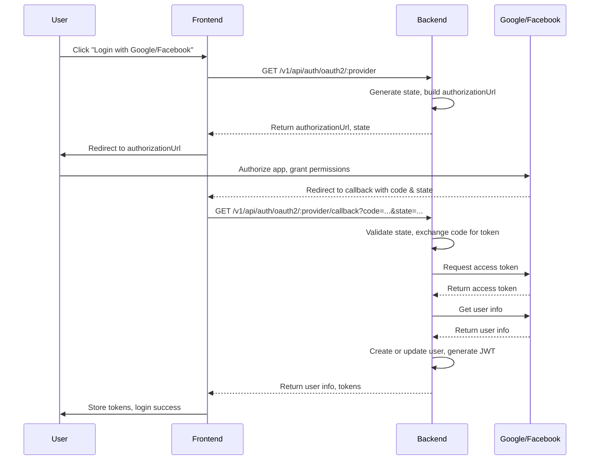

# OAuth2 Authentication Flow for eCommerce Backend

## 1. User Login/Signup with Google/Facebook

## 2. Get Supported OAuth2 Providers
- **Endpoint:** `GET /v1/api/auth/oauth2/providers`
- **Flow:**
    1. Frontend gửi request lấy danh sách provider
    2. Backend trả về danh sách provider khả dụng (Google, Facebook)

## 3. Unlink OAuth2 Provider
- **Endpoint:** `DELETE /v1/api/auth/oauth2/:provider`
- **Flow:**
    1. User gửi request hủy liên kết provider
    2. Backend xác thực, cập nhật trạng thái tài khoản
    3. Trả về kết quả thành công

## 4. Get Linked Providers
- **Endpoint:** `GET /v1/api/auth/oauth2/linked`
- **Flow:**
    1. User gửi request lấy danh sách provider đã liên kết
    2. Backend trả về danh sách provider đã liên kết với tài khoản

## 5. Security & Rate Limiting
- **State parameter**: Được sinh ngẫu nhiên, lưu Redis, kiểm tra khi callback
- **Rate limiting**: Giới hạn số lần request theo IP, bảo vệ chống abuse
- **Security headers**: Thêm vào mọi response OAuth2

## 6. Error Handling
- **Các lỗi phổ biến**: State hết hạn, code không hợp lệ, provider không hỗ trợ, rate limit exceeded
- **Response chuẩn hóa**: code, message, metadata

---

## Tóm tắt luồng chính
1. **Frontend** lấy URL đăng nhập từ backend
2. **User** xác thực với Google/Facebook
3. **Backend** nhận code, lấy access token, lấy user info
4. **Backend** tạo/cập nhật user, trả JWT cho frontend
5. **Frontend** lưu token, hoàn tất đăng nhập

---

> File này mô tả chi tiết luồng OAuth2 cho các chức năng đăng nhập, đăng ký, liên kết và hủy liên kết tài khoản qua Google/Facebook, tuân thủ chuẩn bảo mật và kiến trúc của dự án.
